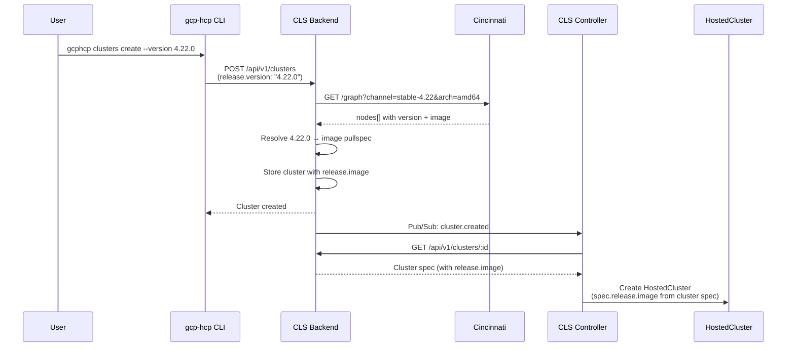
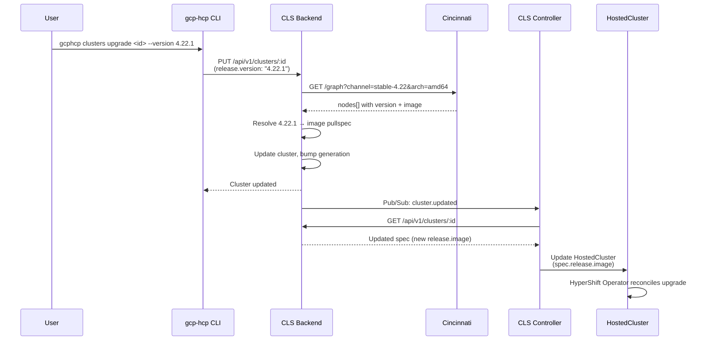

# Adopt Cincinnati for Version Resolution, Selection, and Upgrades

## Overview

This document describes the implementation plan for replacing the hardcoded release image with dynamic version resolution via Cincinnati, enabling OCP version selection during cluster creation and basic upgrade support across the GCP HCP stack (CLI, Backend, Controller).

**Design Decision**: [adopt-cincinnati-for-version-resolution](../design-decisions/adopt-cincinnati-for-version-resolution.md)


## Component Flow

### Version Selection at Cluster Creation



### Upgrade Flow



---

## Implementation Tasks

### Task 1: CLS Backend — Cincinnati Client

**Repo**: `cls-backend`
**Files**: new `internal/services/versions_service.go`

#### Changes Required

Add a lightweight Cincinnati client that queries the graph endpoint and extracts version→image mappings.

```go
type CincinnatiVersion struct {
    Version string `json:"version"`
    Image   string `json:"image"`
}

type VersionsService struct {
    baseURL string // https://api.openshift.com/api/upgrades_info/v1/graph
}

func (s *VersionsService) ListVersions(ctx context.Context, channel, arch string) ([]CincinnatiVersion, error) {
    // GET {baseURL}?channel={channel}&arch={arch}
    // Parse response: extract nodes[].version and nodes[].payload
    // Sort by semver descending
    // Return list
}

func (s *VersionsService) ResolveVersion(ctx context.Context, version, channel, arch string) (string, error) {
    // Call ListVersions
    // Find matching version in nodes
    // Return the image pullspec
    // Error if version not found in channel
}
```

**Cincinnati response format:**
```json
{
  "nodes": [
    { "version": "4.22.0", "payload": "quay.io/openshift-release-dev/ocp-release@sha256:..." },
    { "version": "4.22.1", "payload": "quay.io/openshift-release-dev/ocp-release@sha256:..." }
  ],
  "edges": [[0, 1]]
}
```

Note: The image field in Cincinnati nodes is `payload`, not `image`.

#### Verification

- Unit tests with mock HTTP responses covering: valid channel, empty channel, version not found
- `go test ./internal/services/...`

---

### Task 2: CLS Backend — Versions API Endpoint

**Repo**: `cls-backend`
**Files**: new `internal/handlers/versions_handler.go`, router registration

#### Changes Required

Expose `GET /api/v1/versions` that proxies to Cincinnati.

**Request:**
```
GET /api/v1/versions?channel_group=stable&version=4.22&arch=amd64
```

- `channel_group` — optional, defaults to `stable` (e.g., `stable`, `fast`, `candidate`)
- `version` — required, minor version (e.g., `4.22`)
- `arch` — optional, defaults to `amd64`

The backend derives the Cincinnati channel from `channel_group` + `version` (e.g., `stable` + `4.22` → `stable-4.22`).

**Response:**
```json
{
  "channel_group": "stable",
  "channel": "stable-4.22",
  "arch": "amd64",
  "versions": [
    { "version": "4.22.0", "image": "quay.io/openshift-release-dev/ocp-release@sha256:abc..." },
    { "version": "4.22.1", "image": "quay.io/openshift-release-dev/ocp-release@sha256:def..." }
  ]
}
```

Register the route alongside existing cluster/nodepool routes.

#### Verification

- Unit test for handler with mock service
- Manual test: `curl http://localhost:8080/api/v1/versions?version=4.22`

---

### Task 3: CLS Backend — Version Resolution in Cluster Create/Update

**Repo**: `cls-backend`
**Files**: `internal/services/cluster_service.go`, `internal/models/cluster.go`

#### Changes Required

**3a. Extend ReleaseSpec model:**

```go
type ReleaseSpec struct {
    Image        string `json:"image,omitempty"`
    Version      string `json:"version,omitempty"`
    ChannelGroup string `json:"channelGroup,omitempty"` // "stable", "fast", "candidate"
}
```

- `ChannelGroup` defaults to `"stable"` (same as ROSA CLI); used only for resolution, not persisted separately

**3b. Add resolution logic to CreateCluster and UpdateCluster:**

```go
func (s *ClusterService) resolveReleaseImage(ctx context.Context, release *ReleaseSpec) error {
    if release.Image != "" {
        return nil // explicit image provided, nothing to resolve
    }
    if release.Version == "" {
        // Note: if neither image nor version is provided, the default version
        // logic (3d) should run before this function is called.
        return fmt.Errorf("either release.image or release.version is required")
    }

    // Derive Cincinnati channel from channel group + version (same pattern as ROSA CLI)
    // e.g., channelGroup "stable" + version "4.22.0" → channel "stable-4.22"
    channelGroup := release.ChannelGroup
    if channelGroup == "" {
        channelGroup = "stable" // default, same as ROSA CLI
    }
    parts := strings.Split(release.Version, ".")
    if len(parts) < 2 {
        return fmt.Errorf("invalid version format: %s", release.Version)
    }
    channel := fmt.Sprintf("%s-%s.%s", channelGroup, parts[0], parts[1])
    // Note: if stable channel is empty (e.g., pre-GA), the resolution will
    // fail and the user must explicitly pass --channel-group candidate

    image, err := s.versionsService.ResolveVersion(ctx, release.Version, channel, "amd64")
    if err != nil {
        return fmt.Errorf("failed to resolve version %s in channel %s: %w", release.Version, channel, err)
    }

    release.Image = image
    return nil
}
```

Call `resolveReleaseImage()` in both `CreateCluster()` and `UpdateCluster()` before persisting.

**3c. Validate upgrade path against Cincinnati edges:**

When updating a cluster's release, verify that Cincinnati has a direct edge from the current version to the requested version. The edges are already available in the graph response used for version resolution.

```go
func (s *VersionsService) ValidateUpgradePath(ctx context.Context, currentVersion, requestedVersion, channel, arch string) error {
    graph, err := s.fetchGraph(ctx, channel, arch)
    if err != nil {
        return fmt.Errorf("failed to fetch Cincinnati graph: %w", err)
    }

    // Find node indices for current and requested versions
    fromIdx, toIdx := -1, -1
    for i, node := range graph.Nodes {
        if node.Version == currentVersion { fromIdx = i }
        if node.Version == requestedVersion { toIdx = i }
    }
    if fromIdx == -1 {
        return fmt.Errorf("current version %s not found in channel %s", currentVersion, channel)
    }
    if toIdx == -1 {
        return fmt.Errorf("requested version %s not found in channel %s", requestedVersion, channel)
    }

    // Check for a direct edge
    for _, edge := range graph.Edges {
        if edge[0] == fromIdx && edge[1] == toIdx {
            return nil // valid upgrade path
        }
    }
    return fmt.Errorf("no upgrade path from %s to %s in channel %s", currentVersion, requestedVersion, channel)
}
```

**3d. Default version when none provided:**

When neither `release.image` nor `release.version` is provided, the backend should default to the latest available version for 4.22 (or the current minimum supported minor). The backend falls back through channel groups in order: `stable` → `fast` → `candidate`, picking the latest version from the first non-empty channel. This ensures a default is always available (e.g., pre-GA when only `candidate` has content) and keeps existing e2e tests working without changes.

**3e. Default nodepool release image to cluster's release image:**

When creating a nodepool, if `release.image` is not provided, the backend should look up the parent cluster's `release.image` and use that as the default.

#### Verification

- Unit tests: version-only creation, image-only creation, both provided, neither provided
- Unit tests: channel derivation from version string
- Integration test: create cluster with `release.version: "4.22.0"`, verify stored spec has resolved `release.image`

---

### Task 4: CLS Controller — Dynamic Release Image in HostedCluster Template

**Repo**: `cls-controller`
**File**: `deployments/helm-cls-hypershift-client/templates/controllerconfig.yaml`

#### Changes Required

Replace the hardcoded release image with the cluster spec value.

```yaml
# Before:
spec:
  release:
    image: quay.io/openshift-release-dev/ocp-release:4.20.0-x86_64

# After:
spec:
  release:
    image: {{ `{{ .cluster.spec.release.image }}` }}
```

#### Verification

- Deploy controller with updated Helm chart
- Create a cluster via backend with `release.version: "4.22.0"`
- Verify the HostedCluster is created with the resolved image, not the old hardcoded one
- Verify `oc get hostedcluster -o jsonpath='{.spec.release.image}'` matches the Cincinnati pullspec

---

### Task 5: CLS Controller — Dynamic Release Image in NodePool Template

**Repo**: `cls-controller`
**File**: `deployments/helm-cls-nodepool-controller/templates/controllerconfig.yaml`

#### Changes Required

Update the NodePool template to use the nodepool spec's release image.

```yaml
# Before:
release:
  image: {{ `{{ .nodepool.spec.release.image | default "quay.io/openshift-release-dev/ocp-release:4.20.0-x86_64" }}` }}

# After:
release:
  image: {{ `{{ .nodepool.spec.release.image }}` }}
```

**Note**: The nodepool spec should always have `release.image` set by the backend. If the CLI doesn't provide one, the backend should default to the cluster's release image.

#### Verification

- Create a nodepool without specifying a release image
- Verify the NodePool CR uses the image from the nodepool spec (set by backend)

---

### Task 6: CLI — Version Listing Command

**Repo**: `gcp-hcp-cli`
**Files**: `src/gcphcp/cli/commands/clusters.py`, `src/gcphcp/client/api_client.py`

#### Changes Required

**6a. Add API client method:**

```python
def list_versions(self, version, channel_group="stable", arch="amd64"):
    """List available OCP versions for a channel group and minor version."""
    params = {"version": version, "channel_group": channel_group, "arch": arch}
    return self._get("/api/v1/versions", params=params)
```

**6b. Add `versions` subcommand:**

```bash
gcphcp clusters versions --version 4.22
gcphcp clusters versions --version 4.22 --channel-group candidate
```

Output format:
```
Available versions in stable-4.22 (amd64):

  VERSION    IMAGE
  4.22.1     quay.io/openshift-release-dev/ocp-release@sha256:abc...
  4.22.0     quay.io/openshift-release-dev/ocp-release@sha256:def...
  ...
```

Flags:
- `--version` — required, minor version (e.g., `4.22`)
- `--channel-group` — optional, defaults to `stable`
- `--arch` — optional, defaults to `amd64`

#### Verification

- `gcphcp clusters versions --version 4.22` returns a sorted version list (from stable)
- `gcphcp clusters versions --version 4.22 --channel-group candidate` returns candidate versions

---

### Task 7: CLI — Version Flag on Cluster Create

**Repo**: `gcp-hcp-cli`
**File**: `src/gcphcp/cli/commands/clusters.py`

#### Changes Required

Add `--version`, `--channel-group`, and `--release-image` flags to `clusters create`.

```bash
# Create with version (defaults to stable channel group, same as ROSA)
gcphcp clusters create my-cluster --project my-project --version 4.22.0

# Create with version from a specific channel group
gcphcp clusters create my-cluster --project my-project --version 4.22.0 --channel-group candidate

# Create with explicit image (backward compatible)
gcphcp clusters create my-cluster --project my-project --release-image quay.io/...
```

Update `_build_cluster_spec()` to include the release fields:

```python
if version:
    cluster_data["spec"]["release"] = {"version": version}
    if channel_group:
        cluster_data["spec"]["release"]["channelGroup"] = channel_group
elif release_image:
    cluster_data["spec"]["release"] = {"image": release_image}
```

Flags are mutually exclusive: `--version` and `--release-image` cannot both be specified.

#### Verification

- `gcphcp clusters create --version 4.22.0` creates cluster with resolved image
- `gcphcp clusters create --release-image quay.io/...` still works
- `gcphcp clusters create --version X --release-image Y` returns validation error

---

### Task 8: CLI — Upgrade Commands (Cluster and NodePool)

**Repo**: `gcp-hcp-cli`
**Files**: `src/gcphcp/cli/commands/clusters.py`, `src/gcphcp/cli/commands/nodepools.py`

#### Changes Required

Add separate upgrade subcommands for clusters and nodepools, following the ROSA CLI pattern:

**Cluster upgrade** (control plane only):
```bash
gcphcp clusters upgrade <cluster-id> --version 4.22.1
```

**NodePool upgrade** (worker nodes):
```bash
gcphcp nodepools upgrade <nodepool-id> --version 4.22.1
```

Both commands call their respective `PUT` endpoints with updated release spec:

```python
def upgrade_resource(self, resource_type, resource_id, version=None, release_image=None):
    release = {}
    if version:
        release["version"] = version
    elif release_image:
        release["image"] = release_image

    payload = {"spec": {"release": release}}
    return self._put(f"/api/v1/{resource_type}/{resource_id}", json=payload)
```

**Key design points**:
- Cluster and nodepool upgrades are independent operations (same as ROSA and HyperShift)
- At creation time, nodepools default to the cluster's release image (Task 3e)
- The backend validates upgrade paths for both clusters and nodepools (Task 3c)

#### Verification

- `gcphcp clusters upgrade <id> --version 4.22.1` upgrades the control plane
- `gcphcp nodepools upgrade <id> --version 4.22.1` upgrades the nodepool
- Upgrading a nodepool to a version higher than the cluster's version is rejected

---

## Stories

The implementation tasks above map to 3 stories, one per layer:

### Story 1: CLS Backend — Cincinnati Integration and Version Resolution

**Repo**: `cls-backend`
**Tasks**: 1 (Cincinnati client), 2 (Versions endpoint), 3 (Version resolution + nodepool default)
**Story Points**: 3 — Straightforward work with multiple small pieces (HTTP client, endpoint, resolution, edge validation, defaults). No design needed — just execution. Minor risk around Cincinnati API behavior.

**Acceptance Criteria**:
- [ ] `GET /api/v1/versions?version=4.22&channel_group=candidate` returns available versions from Cincinnati
- [ ] `POST /api/v1/clusters` with `release.version` resolves the image from Cincinnati and stores it
- [ ] `POST /api/v1/clusters` with `release.image` uses the image directly (backward compatible)
- [ ] `PUT /api/v1/clusters/:id` with updated `release.version` validates the upgrade path against Cincinnati edges and resolves the new image
- [ ] Nodepool creation defaults `release.image` to the parent cluster's release image when not provided

### Story 2: CLS Controller — Dynamic Release Image Templates

**Repo**: `cls-controller`
**Tasks**: 4 (HostedCluster template), 5 (NodePool template)
**Story Points**: 1 — Template-only changes. The controller's template engine already unmarshals `cluster.Spec` JSON and exposes it as `.cluster.spec` (see `buildClusterContext` in `internal/template/engine.go:306`). No Go code changes needed.

**Acceptance Criteria**:
- [ ] HostedCluster is created with `spec.release.image` from the cluster spec (not hardcoded)
- [ ] NodePool is created with `release.image` from the nodepool spec (not hardcoded)
- [ ] HostedCluster `spec.release.image` is updated when the cluster spec changes (upgrade flow)

### Story 3: CLI — Version Selection, Listing, and Upgrade Commands

**Repo**: `gcp-hcp-cli`
**Tasks**: 6 (Versions command), 7 (Create --version flag), 8 (Upgrade command)
**Story Points**: 3 — Three new subcommands/flags, all straightforward. The CLI passes parameters to the backend; no complex logic. Some effort for wiring and flag handling.

**Acceptance Criteria**:
- [ ] `gcphcp clusters versions --version 4.22 --channel-group candidate` lists available versions
- [ ] `gcphcp clusters create --version 4.22.0` creates a cluster with the resolved image
- [ ] `gcphcp clusters create --release-image quay.io/...` still works (backward compatible)
- [ ] `gcphcp clusters upgrade <id> --version 4.22.1` upgrades the control plane
- [ ] `gcphcp nodepools upgrade <id> --version 4.22.1` upgrades the nodepool

### Implementation Order

| Step | Story | Points | Dependencies |
|------|-------|--------|-------------|
| 1 | Story 1: Backend | 3 | None |
| 2 | Story 2: Controller | 1 | Story 1 |
| 3 | Story 3: CLI | 3 | Story 2 |

**Total: 7 story points**